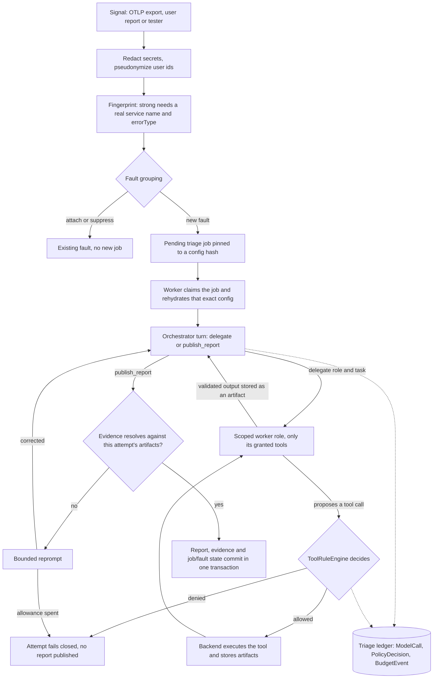

# IncidentCompass

A .NET 10 backend that turns an incident signal into a reviewable, evidence-backed triage report.

The model chooses investigation steps and proposes tool calls. The backend owns credentials, tool
grants, budgets, evidence checks, approvals and external actions.

Version **0.4.0** adds a governed remediation chain from a report to a prepared diff, a human-approved
code write, a branch, a pull request and a ticket backlink; per-provider endpoints and credentials
with one-hop route fail-over; scheduled payload retention; working cost accounting; and an opt-in
evaluation harness with one measured run committed to this repository. Every external write is
separately approved, nothing merges, no test command is executed and the whole chain ships disabled.
See the [release notes](docs/release-notes-v0.4.0.md) for changes and verification.

## One investigation

1. Accept an OTLP trace/log export or an OTel-shaped, user or tester signal; redact it and create a durable triage job.
2. Investigate under the job's versioned configuration, using role-scoped memory, source and ticket tools.
3. Publish a report only after the backend resolves its evidence against allowed stored artifacts.
4. When configured, propose a Telegram notification or GitHub issue action. The backend selects the
   target and freezes the payload; GitHub writes require operator approval.
5. When configured, prepare a diff against a named base tree, then freeze it into a code write, a
   branch, a pull request and a comment back on the cited ticket. Each is a separate approval a person
   grants, nothing merges, and no test command runs, so a diff is untested by construction.
6. Inspect the report, policy decisions, model usage and action outcomes through the API and durable ledger.

## Deterministic demo run

`scripts/demo.ps1 -Mock` drives five scenarios end to end. This is the deterministic mock provider,
not a real model, so the classifications below show the governed path running, not model quality.
For numbers produced by an actual model, see [Measured run](#measured-run) below; the two are
separate records and neither stands in for the other.

~~~text
Scenario | FaultId | ReportId | is_mass_issue | Classification | LedgerUrl | ReportUrl | Check
--- | --- | --- | --- | --- | --- | --- | ---
1 known-timeout-runbook | db50a885-0e75-4726-9825-6c82085a37bf | 8e34e889-39e2-4f7b-8e6a-d838febf75db | false | KnownIncident | http://localhost:5198/api/v1/faults/db50a885-0e75-4726-9825-6c82085a37bf/ledger | http://localhost:5198/api/v1/triage-reports/8e34e889-39e2-4f7b-8e6a-d838febf75db | ok
2 unknown-null-reference | 9a56b670-bfc8-4e64-98dc-debf8fb8ea55 | a483f009-adc0-4f03-a7f6-9cd204e04b18 | false | Unknown | http://localhost:5198/api/v1/faults/9a56b670-bfc8-4e64-98dc-debf8fb8ea55/ledger | http://localhost:5198/api/v1/triage-reports/a483f009-adc0-4f03-a7f6-9cd204e04b18 | ok
3 provider-unavailable-flood | 144467dd-ba0f-4627-ac4d-fc033ea0a55c | 542e060d-e45e-4072-b2d2-fef1b3fd5096 | true | SimpleKnownError | http://localhost:5198/api/v1/faults/144467dd-ba0f-4627-ac4d-fc033ea0a55c/ledger | http://localhost:5198/api/v1/triage-reports/542e060d-e45e-4072-b2d2-fef1b3fd5096 | ok
4 validation-noise | 7c95878e-c56f-41db-808a-5430a15d54af | c4ab8ec5-628f-42ed-bdf4-6944b295cd2b | false | Noise | http://localhost:5198/api/v1/faults/7c95878e-c56f-41db-808a-5430a15d54af/ledger | http://localhost:5198/api/v1/triage-reports/c4ab8ec5-628f-42ed-bdf4-6944b295cd2b | ok
5 injection-disabled-action-gate | 4f705140-7ff5-4d7f-ad08-e8bc90e931b2 | e57a7035-579d-4f75-8684-d6eed5e20889 | false | SimpleKnownError | http://localhost:5198/api/v1/faults/4f705140-7ff5-4d7f-ad08-e8bc90e931b2/ledger | http://localhost:5198/api/v1/triage-reports/e57a7035-579d-4f75-8684-d6eed5e20889 | no action lifecycle events observed across 4 bounded ledger reads
~~~

All five scenarios passed. Scenario 5 prints a detail string instead of `ok` because it aims a
prompt-injection attempt at a disabled action gate, and that detail is the assertion:
[`DemoActionGateResult`](src/IncidentCompass.Tester/DemoActionGateResult.cs) passes only when no
action lifecycle event was recorded at all.

## Measured run

Separately from that mock table, one opt-in evaluation ran against a local OpenAI-compatible provider
on 2026-09-11 at revision `ca86ad5`. The commit that followed it, `a2ca1f6`, added integration tests
and changed no production code. Five frozen cases, three attempts each, criteria authored before any
output was observed. The per-attempt record is committed at
`evaluations/triage/measured-run-ca86ad5.json`.

| Band | Measured |
|---|---|
| Delivery: the signal became a job that reached the provider | 15 of 15 attempts, 192 model calls, all usage provider-reported |
| Terminal completion: the job ended with a schema-valid published report | 15 of 15, no job error codes |
| Diagnostic quality: the report matched the pre-authored criteria | diagnosis 13 of 15, evidence 14 of 15, justified refusal 14 of 15 |
| Side effects: anything written outside the system | none, on every attempt, under empty action grants |

Nine of the fifteen published reports were `InsufficientEvidence`, so completion does not mean the
report answered anything. This is five cases on one model and one machine, with authored keyword
heuristics standing in for diagnosis quality, and an earlier run of the same corpus that same day
finished only 10 of 15. No external action was proposed or executed in this run.

[Measured evaluation run](docs/evaluation-evidence.md) carries the per-case numbers, the two misses
attempt by attempt, the variance, what the metrics are not, and where the external-action chain is
actually proved.

## Try the local flow

Prerequisites: Docker Compose, the .NET 10 SDK for configuration validation, PowerShell and
OpenAI-compatible chat and embedding endpoints. On Windows and macOS, Compose uses
`host.docker.internal:1234` by default.

~~~powershell
Copy-Item .env.example .env
# Set exact chat and embedding model ids in .env.
dotnet run --project src/IncidentCompass.Api -- config validate
powershell -ExecutionPolicy Bypass -File scripts/demo.ps1
~~~

The script builds PostgreSQL, API, Worker and Tester containers, runs the local scenarios and prints
report and ledger URLs. Use `scripts/demo.ps1 -Mock` for the deterministic provider path.

The additive production path is intentionally separate from that demo. See the
[single-host production runbook](docs/single-host-production.md) for loopback-only Compose startup,
preflight, bounded PostgreSQL backup and fresh-volume recovery on one trusted machine.

Compose host-port overrides do not change the fixed internal API, PostgreSQL or OTLP addresses.
The mock overlay replaces only model and embedding providers. GitHub and Telegram adapters retain
fixed production authorities and are tested with in-process recording handlers, not Compose endpoint
doubles or configurable provider URLs.

See [Quickstart](docs/quickstart.md) for setup and [Local demo walkthrough](docs/local-demo.md)
for scenarios, ports and expected output. Optional source, GitHub, Telegram and API-key settings
are in [Integration configuration](docs/integrations.md).

## Guarantees and limits

- Unknown, ungranted or denied tools fail closed through backend policy.
- Reports cite stored evidence from the allowed job and attempt. Valid citations do not prove a correct diagnosis.
- Backend budgets bound investigation work. A single in-flight model call can overshoot the token limit;
  the excess is recorded and further calls stop.
- Approved actions use frozen payloads and at-most-once backend invocation. An uncertain external
  outcome is recorded for operator review and is never automatically resent.
- Automated tests use deterministic providers by default. The mock injection scenario checks the
  disabled-action configuration; separate integration tests exercise configured policy and approval.
- Full rendered prompt/body logging stays disabled by default.

One deployment envelope is supported: **one trusted machine, one trusted operator, one host-owned
monitored checkout, one configured repository and one PostgreSQL database under Docker Compose, with
the API and PostgreSQL bound to loopback.** The
[single-host production runbook](docs/single-host-production.md) is that envelope, with preflight
that refuses demo credentials, bounded backup, a real fresh-volume restore and rollback. Reaching the
API from another machine means putting an authenticated TLS reverse proxy and a host firewall in
front of the loopback port, not rebinding it. Demo authentication and the demo Compose defaults are
local-only. Source lookup and external integrations require explicit host configuration, and every
external action ships disabled.

Outside that envelope, and not provided: high availability or failover, multi-team role-based access,
enterprise identity, a managed secret store (the host owns a protected environment file), more than
one source repository or an arbitrary one, a UI, general cross-fault incident correlation, and
exactly-once external delivery. No process is started anywhere in the product, so nothing here runs a
test, a build or a deployment: a prepared diff is untested by construction and approving one approves
an untested change. And a grounded report is not a correct report; evidence checks prove provenance,
not truth.

## Explore the implementation

IncidentCompass is a layered monolith: API and Worker compose Application use cases and Infrastructure
adapters around a provider-independent Domain. PostgreSQL stores jobs, configuration snapshots,
incident memory, reports, approvals and the audit ledger.

- [Signal intake](src/IncidentCompass.Application/Intake/IngestSignal/Handler.cs)
- [Governed investigation](src/IncidentCompass.Application/Investigation/Jobs/GovernedTriageInvestigationProcessor.cs)
- [Shared tool policy](src/IncidentCompass.Application/Governance/Tools/ToolRuleEngine.cs)
- [Report evidence grounding](src/IncidentCompass.Infrastructure/Investigation/PostgresReportEvidenceGrounder.cs)

Read [Architecture](docs/architecture.md), [Security model](docs/security-model.md) and
[Trade-offs](docs/trade-offs.md) for the boundaries and their costs.

## Documentation

The [documentation index](docs/README.md) states a reading order in three tiers: run it, understand
it, judge it. The direct routes are:

- Run it: [Quickstart](docs/quickstart.md), [Local demo](docs/local-demo.md),
  [Integration configuration](docs/integrations.md) and the
  [single-host production runbook](docs/single-host-production.md)
- Understand it: [Architecture](docs/architecture.md), [Security model](docs/security-model.md),
  [Model gateway](docs/model-gateway.md), [Observability](docs/observability.md) and
  [Cost tracking](docs/cost-tracking.md)
- Judge it: [Trade-offs](docs/trade-offs.md), [Code organization](docs/code-organization.md),
  [Versioning and release flow](docs/versioning.md), [Contributing](CONTRIBUTING.md) and the
  [security policy](SECURITY.md)
- Reference: [Changelog](CHANGELOG.md) and release notes
  [0.4.0](docs/release-notes-v0.4.0.md), [0.3.0](docs/release-notes-v0.3.0.md),
  [0.2.0](docs/release-notes-v0.2.0.md), [0.1.1](docs/release-notes-v0.1.1.md) and
  [0.1.0](docs/release-notes-v0.1.0.md)

## Origin

IncidentCompass was bootstrapped from
[dotnet-genai-starter](https://github.com/ilagutin/dotnet-genai-starter)'s layered .NET structure and
model/embedding gateway boundaries, then specialized into incident triage. General chat, document
ingestion and MCP product surfaces are outside this repository's scope.
