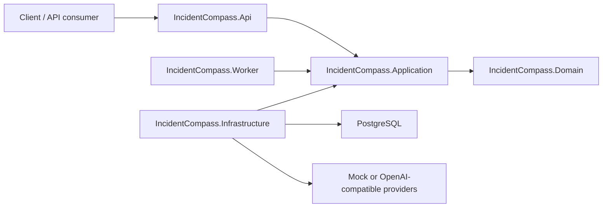

# Architecture

This project is a .NET-native governed incident-triage agent backend. It demonstrates production-aware patterns, but it is not a framework with stable public extension contracts.

The implementation is a layered monolith. The application layer is a single project organized into folders so the codebase stays easy to navigate as new capabilities are added (the layering is by convention and `ArchitectureTests`, not enforced module assemblies):

## Projects

- `IncidentCompass.Api`: HTTP endpoints, OpenAPI, demo auth adapter, request/response mapping.
- `IncidentCompass.Application`: single application project with populated feature folders:
  - `Core/`: dispatcher, pipeline behaviors, identity/correlation contracts, shared configuration, base errors, health echo, current-user use case, and model/embedding gateway abstractions.
  - `Governance/`: common worker-tool contracts, validation primitives, durable triage-ledger ports
    and post-report evaluation and action approval contracts and use cases.
  - `Intake/`: source normalization, input limits, redaction, fingerprinting, fault grouping, triage-job creation and grounded intake artifacts for ingestion.
  - `Investigation/`: Worker job claim/runtime seams that rehydrate claimed jobs by config hash and hand them to the governed investigation processor.
  - `Memory/`: memory search contracts, seed records and the governed `memory_search` worker tool.
  - `Notifications/`: ordered notification routing and the non-secret Telegram tool descriptor.
    The Worker-owned workflow accepts report identity and a configured route id, not recipient or
    message text.
  - `Observability/`: the tenant-scoped model-cost rollup read request, validator, response and
    persistence port.
  - `SourceContext/`: provider-neutral source lookup contracts, bounded stack-frame extraction and
    the governed `source_lookup` worker tool.
  - `Tickets/`: system-neutral ticket-search, cited-ticket resolution and ticket-action-history
    contracts, backend signal-field extraction, the governed read-only `ticket_search` worker tool
    and the non-secret `ticket_create` and `ticket_update` action descriptors and payload rules.
- `IncidentCompass.Domain`: simple domain records, enums and workflow state types shared by Application use cases.
- `IncidentCompass.Infrastructure`: PostgreSQL persistence adapters, intake repositories/config loading,
  post-report evaluation and action approval/provenance repositories, model clients, embedding clients,
  memory adapters, the model-cost rollup persistence adapter and other infrastructure adapters.
- `IncidentCompass.Worker`: DB-backed background host with separate bounded triage-job, post-report
  evaluation and approved-action pumps. Triage jobs and evaluations use renewable ownership-fenced
  leases and per-process concurrency limits; approved actions use immutable dispatch fences, deadlines
  and at-most-once backend invocation.
- `IncidentCompass.Tester`: the HTTP-only demo and evaluation driver. It references no other project
  in the solution and speaks to the API as a black box, so it deliberately declares its own local
  copies of Domain and Application concepts instead of sharing types.

## Intake Flow

`POST /api/v1/incidents` accepts a small incident envelope. API mapping stays transport-only and dispatches `IngestSignalCommand`. Application validation checks configured source allow-list and payload size limits, normalizers produce a handler-ready signal shape, redaction removes obvious secrets while preserving null optional text fields, and fingerprinting classifies signals as `Strong` only when both service name and structured `errorType` are present. `FaultGrouping.FingerprintRules` can select service, operation and source-specific normalized inputs through an ordered deterministic rule set; every resulting signal, fault and `NeighborSet` records the effective rule id and version, so a later rule generation cannot merge into its predecessor. Fault grouping then either attaches to an open strong fault in that exact generation, applies the deterministic service/severity policy selected from `FaultGrouping.SuppressionRules` to suppress a recent closed strong fault, or opens a new fault and pending triage job. Each signal and `NeighborSet` records the effective policy id and window; unmatched signals use the `default` policy with the global `SilenceWindowMinutes`, while the stable suppression reason remains `silence_window`.
These are four separate intake decisions. Delivery deduplication returns the already accepted signal for the same tenant, source and delivery key, so retries do not change any facts. Open-fault grouping attaches a different accepted signal to the one open fault for its exact fingerprint-rule generation. Suppression stores a different accepted signal against a recently closed fault without opening a job. A later, non-suppressed recurrence opens one recurrence fault and job; every distinct accepted signal attached to that open recurrence increments the transactionally locked group-generation recurrence state. The state stores first and last recurrence timestamps and creates at most one escalation intent for its configured threshold. `RecurrenceState` is a job-level citable artifact and is replaced when an attached signal advances the state. A duplicate delivery never advances recurrence state or creates an escalation intent.

Incident-data tenancy is resolved by the server-owned `IIncidentTenantContext`, never by
sender-controlled envelope, demo-header or OTLP fields. The auth-disabled local path returns
`Ingestion.DefaultTenant` consistently for manual and OTLP intake. When API-key authentication is
enabled, the API composition maps each accepted host-managed key to exactly one tenant through
`IUserContext` and `IIncidentTenantContext`; Worker background identity remains separate.

## OTLP Ingestion

The API also exposes standard OTLP/HTTP protobuf endpoints at `POST /v1/traces` and `POST /v1/logs`.
The transport adapter is deliberately confined to `IncidentCompass.Api`: it decodes the pinned upstream
OTLP protobuf schema, maps resource, span or log attributes into `IngestSignalCommand`, then dispatches
the existing `otel` normalizer. OTLP/protobuf concepts do not enter Domain or Application contracts.

Only `application/x-protobuf` and `application/protobuf` requests are currently accepted. Metrics,
profiles, protobuf JSON and compressed OTLP payloads are not supported by this release. The `Ingestion.Otel`
configuration controls error-only, service and severity trigger filters; an empty allow-list means no filter.
Ignored telemetry returns a valid empty OTLP response and does not create a signal or triage job. A delivery
key derived from `externalId`, or from trace plus span when no external ID exists, is unique per tenant and
source, so exporter retries return the accepted signal rather than adding a neighbor or job.

One export is bounded twice: `IngestionLimits:MaxPayloadBytes` caps its size in bytes and
`IngestionLimits:MaxSignalsPerExport` caps how many records it carries. The record bound exists because
protobuf is compact enough that a payload inside the byte cap can still hold a very large number of spans
or log records, each of which can open a fault and a triage job. It is applied to the records the parsed
export carries, before mapping and before any command is dispatched, so an over-limit export is rejected
whole with `413 Payload Too Large` and creates no signal, fault or job; partial ingestion would leave a
caller unable to tell what was stored. Both bounds are independent of request rate limiting.
The PostgreSQL schema added in `infra/postgres/init/007-intake.sql` stores `signals`, `faults`, `triage_jobs`, `triage_config_snapshots` and `triage_artifacts`. `triage_artifacts` carries job-level intake facts (`TriggerSignal`, `NeighborSet`, optional `RecurrenceState` and optional `PriorReport`) plus attempt-level `WorkerOutput`, `RetrievedItem` and `ToolResult` artifacts. Migration `infra/postgres/init/008-triage-ledger.sql` provides append-only DB-ordered triage events. Migration `infra/postgres/init/009-triage-reports-minimal.sql` defines grounded `triage_reports` plus `triage_evidence` persistence. Migration `023-action-approvals-outbox.sql` adds immutable post-report approval tuples, closed provenance, `ProposedAction` and `ActionResult` artifacts and constrained action lifecycle events. Migration `024-post-report-action-intents.sql` adds the durable evaluation queue that can create those proposals without becoming another action outbox. Migration `025-external-action-audit-projection.sql` adds an indexed immutable compact projection for confirmed Telegram and GitHub terminal results without changing the released 023/024 migrations. The Worker claim loop leases pending/retryable jobs, rehydrates each job's triage configuration from `triage_config_snapshots` by `config_hash`, runs a governed orchestrator with only `delegate(role, task)` and `publish_report(report_json)`, validates `delegate.role` against the config-derived role set, executes workers sequentially, enforces per-attempt budget and bounded reprompt policy, evaluates worker-tool rules over the ledger, and closes the job/fault only when backend-grounded report publication commits.

## Memory Worker

Incident memory uses PostgreSQL through `incidentcompass.memory_items` and `incidentcompass.memory_chunks`. File-backed memory sync reads the supported kinds runbook, known incident, operational note, release note and postmortem with optional service/component/release metadata; the repository ships runbook and known-incident corpora only. Within a configured seed owner, source path is the stable identity: changed files update and re-embed one active item, while removed files are deactivated and excluded from search. Each complete corpus is published atomically as an owner-scoped generation, so a divergent owner cannot deactivate another owner's items. API and Worker can sync the same owner concurrently under a corpus database lock. Runtime resync is opt-in, single-flight and cancellation-aware; it persists only timestamps, generation and a sanitized error code by seed tenant and owner for the memory-sync health status, so the API can read the Worker-persisted synchronization snapshot across process boundaries; it is not a Worker liveness probe. The manual `CurrentReleases` map is the single per-service release marker: memory retrieval labels matching evidence as current, stale, unversioned or service-mismatched before it reaches the model. Report publication derives and verifies the stored documentation-fit status from those durable artifacts. The configured embedding model is used by default; the mock embedder is reserved for tests and explicit mock-only checks. The `memory` role is the only shipped role granted `memory_search`; the orchestrator never searches memory directly.

`memory_search` embeds the worker query once through the tool's configured `EmbeddingRouteId`, then asks PostgreSQL for a bounded vector candidate set of `min(100, TopK * 4)`. Exact tenant, embedding provider, embedding model, embedding dimension and active-item filters apply before vector ordering and the candidate limit. Application-owned ranking applies lexical coverage and fixed metadata rules, then returns the configured final `TopK`. Current evidence for the fault service and its snapshotted `CurrentReleases` marker ranks before stale or wrong-service evidence. Component and evidence-kind boosts require exact normalized query aliases; neither is inferred from model output or accepted as a tool argument. Ties resolve by combined score, vector score and chunk UUID. A model/provider/dimension mismatch returns an honest empty result instead of falling back to fuzzy retrieval. Successful matches are written as attempt-level `RetrievedItem` artifacts with `domain_ref = memory_item:<id>`, and those artifacts commit in the same transaction as the `ToolResult` artifact and ledger event.
## Read-only source context

`source_lookup` has an empty model-facing argument object. The backend supplies the redacted trigger
signal, fault service and the service's single snapshotted `CurrentReleases` marker. Infrastructure
selects only an exact host-configured `(service, release)` local root, maps standard .NET frames
heuristically, canonicalizes every candidate below that root and reads bounded UTF-8 text excerpts.
Build-path prefixes are host-owned translation hints; traversal, foreign roots, sibling-prefix
confusion, ambiguous suffixes and symlink/reparse escapes fail closed. Remote checkout and
Source Link/PDB mapping are outside this adapter.

Successful excerpts use existing attempt-level `RetrievedItem` persistence and the existing
`triage_evidence.kind = RetrievedItem` value, with a closed `evidenceKind = SourceCode` artifact
payload and `source:` domain reference. Grounding validates the payload shape and release against
the job snapshot; report reads expose that artifact payload alongside the citation. A current-attempt outcome reader applies canonical
no-match or connector-unavailable limitations before final publication, so model prose cannot omit
those outcomes or turn them into evidence.

## Read-only ticket context

`ticket_search` has an empty model-facing argument object. The backend supplies only bounded fault
fingerprint and service plus redacted trigger-signal component, error type, error message and known
labels. The Application keeps search request/result concepts on the read port. Its separate
ticket-action history and cited-update-evidence ports, action descriptors, eligibility checks and
payload factories remain provider-neutral; none contains a provider DTO, HTTP concept, repository
selector or credential.
GitHub Issues is the first Infrastructure adapter; tests also exercise a differently shaped mock
tracker through the search port.

The GitHub adapter sends one bounded request to the fixed `https://api.github.com` authority, with
redirects disabled and a repository selected only by validated host options. The query is capped at
256 characters and four `OR` operators. At most 50 issues are considered, pull requests and
cross-repository or non-canonical candidates are rejected, and deterministic normalized features
produce a six-decimal score. Matches below `0.15` are omitted; at most five remain, ordered by score
then issue number. GitHub result ordering is not treated as IncidentCompass relevance.

Successful matches use the existing attempt-level `RetrievedItem` persistence and
`triage_evidence.kind = RetrievedItem`, with a closed `evidenceKind = ExistingTicket` payload and
`ticket:github:` domain reference. Issue bodies are transient ranking input and are never placed in
tool output, artifacts or reports. The shared durable outcome policy adds canonical no-match or
connector-unavailable limitations before publication even if the model omits them.

## Governed ticket create

`ticket_create` is a backend-owned post-report action and never appears in a role or investigation
model tool surface. Its workflow selects only an exact enabled action descriptor and carries no route,
provider authority or repository in the durable evaluation input. Inside the existing fault-locked
proposal transaction, the repository rechecks the current report, current adapter binding and exactly
one successful current-attempt `ticket_search` result. Only a repository-bound `no_match` for provider
`github` and the Worker-configured repository is eligible; matched, unavailable, malformed, foreign or
ambiguous results deny without an action.

The frozen canonical payload contains a bounded backend-built title/body, immutable report identity
and a lower-hex correlation marker derived from the proposal key and report id. Repository and API
authority remain host facts. Every ticket-create category requires approval through the existing hash
contract even under otherwise permissive policy. After approval, the Worker adapter checks bounded
same-fault action history and performs bounded marker preflight reads. A confirmed earlier issue is
returned without a write; a prior outcome-unknown permits lookup but never another POST. A definitive
empty preflight permits at most one issue POST. Authentication, authorization, rate-limit, malformed
or transport failure before the POST is a stable no-write result; cancellation, timeout, lost
connection or unreadable response after it starts becomes `dispatch_outcome_unknown`.

## Governed ticket evidence comment

`ticket_update` is a separate backend-owned post-report action with category `ticket_update`; it does
not reuse create identity and never appears in the investigation model tool surface. Its workflow
resolves exactly one `ExistingTicket` cited by the current completed report and accepts it only when
the closed evidence payload and domain reference identify the Worker-configured GitHub repository.
Missing, malformed, foreign or multiple candidates produce no proposal. The proposal transaction
rechecks the current report, adapter binding and exact cited issue under the existing fault lock.

The adapter freezes a bounded backend-built comment, report identity, cited issue number and stable
lower-hex marker into the approval contract. Exact-hash operator approval is mandatory. Before the
single possible comment POST, bounded target and first-page comment reads validate the issue and look
for the marker. An existing exact marker returns the bounded comment identity without another write;
any ambiguous, paginated, malformed, authentication, authorization, rate-limit, timeout or transport
preflight result fails definitively with zero writes. Only cancellation, timeout, lost connection or
an unreadable response after the comment POST begins becomes `dispatch_outcome_unknown`. Title,
state, labels, assignees, close/reopen and repository mutation remain outside this action.

## Grounded Reports

`publish_report` is a backend-grounded closeout instead of a model-authored row write. The model supplies report fields and evidence `referenceId` values, but the backend validates the report shape, rejects non-citable or out-of-attempt references, derives `is_mass_issue` from the job-level `NeighborSet`, derives evidence kind from artifact state and `memory_items.kind`, and persists `triage_reports`, `triage_evidence`, job/fault terminal state and `ReportPublished` in one transaction. `WorkerOutput` artifacts are never citable. `GET /api/v1/triage-reports/{id}` returns the report and grounded evidence, including the cited artifact payload.

## Report Lifecycle

`infra/postgres/init/018-report-lifecycle.sql` makes published report rows immutable. Publication serializes on the fault row, inserts a new row with the producing job and an explicit `supersedes_report_id`, and never rewrites prior report content or evidence. `019-retriage-jobs.sql` adds an exactly-once recurrence trigger per source job and constrains its predecessor report to the same fault. When a recurrence escalation finds a prior report anywhere in its recurrence chain, intake creates a pending re-triage job for that reported fault in the same transaction, copies citable recurrence facts, and adds the prior report as an explicitly untrusted `PriorReport` artifact. A re-triage publication must cite `RecurrenceState`; it may independently classify the incident differently. The report detail response exposes predecessor, successor and latest-chain state. `GET /api/v1/faults/{faultId}/triage-report` returns the newest chain head while `GET /api/v1/triage-reports/{id}` continues to retrieve any historical report. `GET /api/v1/triage-reports` returns compact report summaries only, ordered by `(createdAtUtc DESC, reportId DESC)` with a bounded opaque keyset cursor. It supports fault, service, environment, status and classification filters and exposes predecessor, successor and latest-chain fields without evidence payloads. All fault, ledger and report reads are tenant-scoped; out-of-scope objects return `404`.

`GET /api/v1/observability/cost-rollups` is a separate authenticated read use case. Application owns
the UTC-only, inclusive-start/exclusive-end, maximum-31-day window contract and obtains the tenant
only from `IUserContext`. Infrastructure reads `ModelCall` rows through their fault ownership, parses
bounded metadata fail-closed, matches provider/model identifiers case-sensitively against exactly one
effective pricing interval and groups safe totals by UTC hour. The response does not expose tenant,
fault, job, provider, model or logical route identifiers. Missing, malformed or ambiguous pricing is
reported as an unpriced call, never as zero spend. No alert or price mutation path is coupled to this
query.

## API authentication boundary

API-key parsing, digest matching, credential reload, authorization metadata and rate limiting live
only in `IncidentCompass.Api`. The Application contracts remain provider-neutral: an authenticated
API request is projected into the existing `IUserContext` plus `IIncidentTenantContext` ports. One
host-only credential maps a stable key id to exactly one tenant. The API composition replaces the
config-default incident tenant adapter only when API-key authentication is enabled; Worker
composition and background identity are unchanged.

The API installs a fallback policy so new routes are protected unless they explicitly opt into the
small metadata-only anonymous allowlist. Authentication precedes the zero-queue global limiter,
which partitions protected traffic by backend-resolved key id. Credential digests and limiter
settings are host configuration, not triage configuration, Domain state or persistence schema.

## Rules

- Domain must not depend on Application, Infrastructure, Api, Worker, provider SDKs or persistence libraries.
- Application owns use-case contracts, ports, orchestration, validation policies and pipeline behavior.
- Infrastructure implements application ports and persistence adapters. Live model observability is recorded through triage-ledger `ModelCall` and `BudgetEvent` rows. The read-only cost-rollup adapter joins tenant-owned faults to bounded `ModelCall` windows and resolves operator-maintained effective pricing without changing those write paths.
- API and Worker hosts should call application use cases instead of duplicating orchestration.
- Provider SDKs must not appear in controllers or use-case handlers.
- Keep the system a layered monolith for this project's scope.

## Style

Use Clean Architecture with Domain-owned records and enums for shared workflow concepts, and Application-owned orchestration, validation policies and pipeline behavior. FluentValidation is the request-validation framework, and the internal dispatcher runs pipeline behaviors for cross-cutting concerns such as request logging and validation before handlers execute. Use CQRS-lite where it improves clarity, but avoid separate read/write stores, event sourcing and ceremony that does not serve the project.

Follow `docs/code-organization.md` for maintainability guardrails. In short: keep classes small, keep one entity per file, split unrelated responsibilities, and keep application handlers focused on use-case orchestration.

## Governance Rails

Worker tools execute within the layered monolith under backend governance. Worker roles receive only registered backend tools that are both configured and granted to that role. Proposed worker calls are recorded as `ToolProposed`, evaluated by the single live `ToolRuleEngine` over current-attempt ledger state by default, recorded as `PolicyDecision`, and successful executions commit a `ToolResult` artifact plus `ToolResult` ledger event atomically. `ToolResult` status and `BudgetEvent` deltas are stored in first-class ledger state, not parsed from rationale text. Configured rule scopes are limited to `attempt` and `job` for the MVP; `fault` scope remains deferred. The shipped immediate read tools are `memory_search`, `source_lookup` and `ticket_search`; synthetic `tool_x`/`tool_y` exist only in integration-test composition for cross-tool governance cases.

## Post-report Action Approval Boundary

Successful report publication appends at most one immutable evaluation intent per selected exact
tool in the same database transaction as the report and `ReportPublished`. Each intent stores only
report, fault, job, attempt and configuration identities, exact tool/workflow version, an optional
bounded route id, deterministic proposal key and canonical minimal workflow input. It does not copy
report text, evidence bodies, prompts, provider responses or credentials.

The evaluation pump scans without locks, then claims one candidate in a fault-first transaction with
a random fence and database-clock lease. It renews while trusted backend workflow code evaluates,
retries only bounded transient failures and dead-letters malformed input, missing exact catalog
membership or exhausted attempts. Shutdown cancels and observes the evaluation task; an unfinished
claim remains recoverable after lease expiry. At the attempt ceiling, one same-count recovery claim
is allowed only when the exact proposal already exists; another lost recovery claim dead-letters.
A workflow may submit only through the existing
post-report proposal use case. The queue adds no policy path, action adapter or ledger vocabulary,
and `action_approvals` remains the only approval and dispatch outbox. Application composition
registers the non-secret Telegram, ticket-create and ticket-update descriptors so API startup can
validate public configuration without credentials. Worker composition alone registers their
workflows, host bindings and adapters.

An action proposal freezes approval contract v1 over the immutable origin report id, exact tool id,
category, effective mode, logical target, secret-free adapter binding fingerprint, canonical payload
bytes and payload hash, plus a deterministic provenance hash. Provenance contains only the immutable
origin report and its persisted same-job evidence from the report attempt. Trust labels are derived
from artifact kind by the backend; model-supplied labels and working/output artifacts are rejected.

`IAgentTool` contains common definition and validation only. `IImmediateAgentTool` is the only
capability visible to investigation workers. `IExternalActionTool` is a separate post-report
capability with a backend-registered category, logical target and secret-free binding fingerprint.
Configuration cannot reclassify one capability as the other. The snapshotted `Actions` section has
an exact `AllowedTools` grant, a global `live`, `dry_run` or `disabled` ceiling, a force-approval
control and a bounded approval TTL. Per-tool mode can only tighten the global mode. Every category
except `notification` always requires approval, regardless of configuration.

Proposal, decision, claim and terminal operations use PostgreSQL transactions with action-specific
ledger events. Report publication and all action transitions acquire one shared fault-row lock before
job, report or action locks. This makes the latest-report check a serialized boundary and avoids an
action/publication lock inversion. Candidate scans are nonlocking and bounded; each candidate is
rechecked in its own fault-first transaction.

The backend-owned proposal use case resolves a same-tenant current published report, reloads its
exact configuration snapshot and calls the shared `ToolRuleEngine` only after the proposal transaction
has acquired the fault lock, rechecked current origin and locked its job. External preconditions and
caps read ledger facts through that same transaction. Accepted proposal caps count all `ActionProposed`
rows, whether the resulting state is requested or auto-approved. A denial after safe origin resolution writes one bounded
`PolicyDecision` and no action rows. Missing, foreign, failed or superseded origins write nothing.

Telegram routing is part of the immutable triage configuration. It is an ordered list of at most 32
routes with unique route, tool and logical-target bindings. A route can match exact normalized service
and environment selectors plus a closed severity subset; the first match wins and there is no fanout.
The selected route contributes only its id. The Worker-owned binding supplies the one fixed chat id,
bot token and fixed `https://api.telegram.org` authority. Proposal creation runs under the fault lock:
exact proposal replay wins first, unclaimed notification proposals are superseded, an already-started
notification denies a successor, and a database-clock 30-minute cooldown measured from durable
dispatch start follows confirmed live success or `dispatch_outcome_unknown`. Dry-run, requested,
rejected, expired and definitive
pre-mutation failure do not start that cooldown.

`/api/v1/action-approvals` exposes compact tenant-scoped lists, immutable review details, approve and
reject. Review details are reconstructed from tuple and provenance rows, not the `ProposedAction`
artifact JSON. The Worker action pump first expires requested rows, fails superseded unclaimed rows
and recovers expired in-doubt claims, then scans approved candidates. Each candidate is rechecked in
its own fault-first transaction and receives one owner, fence, database start and deadline. Before an
adapter call, the dispatcher verifies the exact registered capability, current policy tightening and
the frozen binding fingerprint. Dry-run records a simulated result with no call. A live call receives
the stored payload bytes and durable action id; terminal state, `ActionResult` and `ActionCompleted`
commit atomically under the fence. A confirmed live Telegram or GitHub success also commits one typed
projection in that transaction: exact external kind/id and a closed before/after marker. Failure,
outcome-unknown and dry-run leave it null. List/get responses expose only those safe fields, and list
lookup accepts only an exact paired kind/id under the authenticated tenant. The partial index follows
that tenant/kind/id lookup. Detailed canonical provider results remain in `ActionResult`; no arbitrary
JSON index or second audit ledger is introduced.

The dispatcher never automatically invokes an action again after claim. An exception, timeout,
cancellation or process loss after invocation leaves either an immediate outcome-unknown result or an
in-doubt row that deadline recovery closes as `dispatch_outcome_unknown`. A late completion cannot
cross the fence/deadline transition. Telegram and GitHub HTTP tests use deterministic in-process
handlers; the automated suite never calls a real provider.
